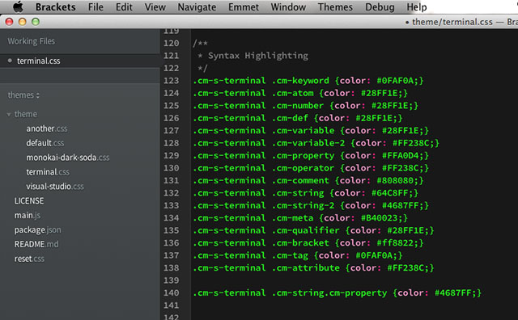
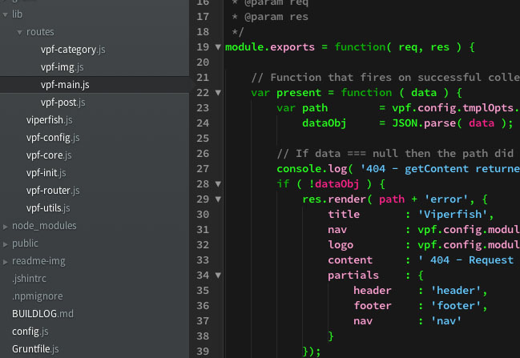
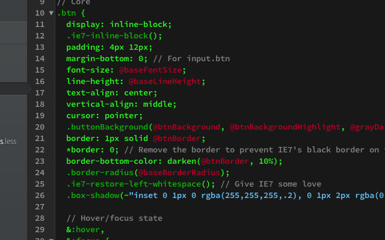
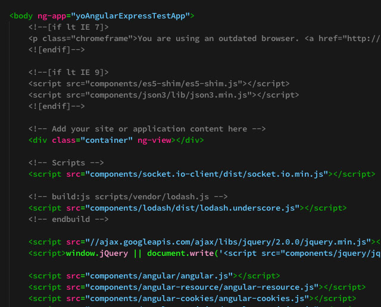
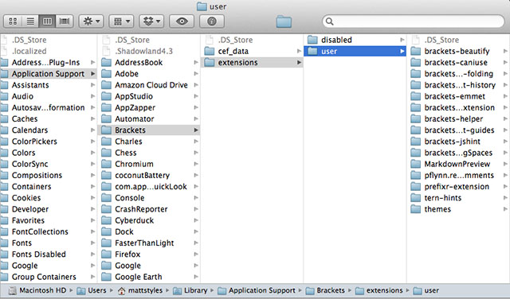

# Terminal Theme for Brackets

Adding a custom theme or tweaking an existing theme for your own tastes using Brackets is really easy, quick and flexible.  The following short steps should help you get started shaping the look the feel of Brackets.

A few weeks ago I released a post detailing a quick summary of the changes from [Brackets Sprint 25](../brackets-sprint-25/) and in that post showed a little of how I’ve customised Brackets to have a look and feel that I want using a custom theme.

The _Terminal Theme_ was designed to be clear, precise and uncluttered.  It allows the user to focus on their code by producing minimal on-screen distractions.  The colour scheme is designed to highlight the code and make sure that important constructs within the code stand out allowing you to quickly pick up things like local variables, functions and selectors (etc etc).

> Creating or customising a theme in Brackets is a simple and intuitive task with few pitfalls

Here are some shots of _Terminal_ in action, using javascript, less and HTML.

### 1 Get Brackets

First step, if you haven’t already done so, is to head to [downloads.brackets.io](http://download.brackets.io/) and download the latest build.  At the time of writing this is Sprint 26 and as the team are on holiday Sprint 27 is likely to be bypassed, whatever the build number the process of including an extension and manipulating that extension is unlikely to change.

### 2 Get a Theme Extension

There are actually a couple of extensions that load up themes but I use the one by [Miguel Castillo](https://github.com/MiguelCastillo/Brackets-Themes).  It is clear and simple and does exactly what you would expect; perfect!

Navigate to __File|Extension Manager__ (or hit the little Lego Brick in the main toolbar—the toolbar moves around a little from sprint to sprint but at the time of writing is on the right hand side) and hit __Install From Url__ and then use __https://github.com/MiguelCastillo/Brackets-Themes__ as the URL to install __Brackets-Themes__.

_The exact steps are subject to change from sprint to sprint but the basic premise of downloading an extension will remain the same_.

### 3 Open the Extensions Folder

Navigate to __Help|Show Extensions Folder__ and your OS will open up the folder that houses your extensions.  On a Mac it will be somewhere like this:

The themes manager you’ve just downloaded from _Step 2_ is located in the __themes__ folder.

There isn’t much going on in this folder, there are a couple of files that contain the theme manager and there is a folder titled __theme__ which is where the action is for us.

### 4 Use Brackets To Code Brackets

Like Googling _'Google'_, this step may sound like the world is about to implode but it probably won’t.  Open up the themes folder in Brackets and have a look at a couple of the _.css_ folders that define the theme.

Yes, you read that right, Brackets uses a language that excels at creating presentation rules to define it’s presentation.  Simple and brilliant.

### 5 Download terminal.css

My own theme that I am using is [terminal.css](https://github.com/mattstyles/brackets-theme-terminal).  I wanted a theme that is clear, uncluttered and focusses on code and constructs _within_ the code.  Terminal is the product—a highly readable theme that makes the code the integral part.  

As Brackets uses CSS to control it’s looks you have an amazing amount of control over the look and feel of Brackets just by applying (or tweaking) a few simple style guidelines although you could go diving into the code to make more drastic changes—the code is well organised and well documented but it is still developing so if you go poking around in core then your changes will be over-ridden when you download and use new sprints, you could circumvent this by [creating an extension](https://github.com/adobe/brackets/wiki/How-to-write-extensions) of course.

Go ahead and download __terminal.css__ from Github and place it into the __themes/theme__ folder within your __extensions__ folder.

> I use [Source Code Pro](https://github.com/adobe/source-code-pro) as my coding font and the theme will use that if available, it fits great with Brackets so go get it!

### 6 Restart Brackets and Change Themes

For this theme to show up you’ll probably need to restart Brackets, the simplest way is to hit `cmd-R` (for Mac) or `ctrl-R` (for Windows).  Open up the __themes__ menu item and you should see __Terminal__ as a theme option, select it and Brackets should start using the rules defined in __terminal.css__ (_you may need to restart Brackets again, sometimes it gets a little confused_).

### 7 Start Developing Your Theme

If you don’t like some aspects of _Terminal_, or any other theme, then open up the relevant _css_ file and start changing some rules.  

I’m big into colour theory so I did a fair amount of research into which colours to use where but you can be more cavalier until you find colour combinations that suit you.

There is a `.test` class in _terminal.css_, ignore this, it is only included to make it easier to know which colour was which while I was developing the theme.  I’ve left it in the CSS as I may yet make further tweaks to the colour scheme, probably in response to using Brackets for more languages but possibly due to installing new extensions.

### 8 Open Up The Developer Tools

To make theme development even easier you can open up the Developer Tools, `cmd-alt-I` for Mac, which will open up Chrome-like tools for inspecting and tweaking with your CSS rules.

For the most part CSS rules are logically named and the DOM structure for Brackets is usually straight-forward.  There are some nice little uses of CSS in there but the best case of action is to dive on in there and get fiddling.  If you’ve worked with [Code Mirror](http://codemirror.net/) before then the structure should be even easier to understand.

### 9 Let Me Know About Your Themes

So I’m normally interested in what people come up with and I like to know why people like certain combinations, please shout about your creations!

---

Want to discuss this article?  Hit me up [@veryfizzyjelly](https://twitter.com/veryfizzyjelly)

---

Posted in [Coding](../ "coding") on July 6th 2013.  _Brackets_, _Terminal_, _Themes_, _Design_, _Colour_