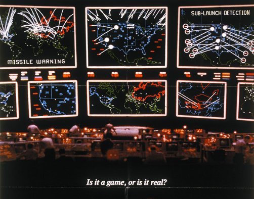

# Codename Missile Command

For me, Ludum Dare was, unfortunately, a total non-starter. It only ruddy clashed with a wedding on the Saturday, I then got a lovely spot of seasonal flu to halt any chances of trying to smash something worthwhile out on the Sunday. However, its not over, the spirit of Ludum Dare is in the creation so I’m going to implement a couple of new rules just for myself.

This, of course, won’t result in an entry to the competition but it should hopefully result in a finished (of sorts) product in a limited timeframe and that’s the real achievement of taking part in Ludum Dare.

My new rules are something like this:

* 30 hours active development time. Yes, the competition stipulates 48 hours but that’s 48 hours flat, in all honesty I’d probably aim for around 12 hours sleeping during that time and I’ve knocked off another 6 hours for other tasks that wouldn’t be active development during the 2 day period. 30 hours is probably still too long but it sounds fair.
* In conjunction with the competition rules, the 30 hours does not need to include time for a build and deployment system, I already had the bones of that anyway, but, it will include any time spent bending that build system or improving it.
* Repo starts clean of code and assets.
* I’ll be keeping a journal/log of where I’m spending time. This is mostly a time-keeping exercise to make sure I don’t slip over. Time spent recording my time doesn’t count towards the 30 hours.
* The 30 hours isn’t going to be straight, otherwise I’d stick to the original rules. The only way it’s going to work for me is a couple of hours a night. Now, I can’t turn my brain off so I will be thinking about the project outside of the 30 hours, which is huge massive great big advantage. Get over it, I’m not entering, this is just for funsies.

These new rules I think are keeping in spirit with the competition; I lose the camaraderie but I gain loads of time in between active development sessions, all in all, I’m probably well up on the deal but this is the only I can make it work and keep in the spirit of things. Hopefully the next competition will be different.

## Game on a Screen

The theme of **#LD31** is **Entire Game on One Screen** so, to that end, my concept will be a game where you take control of a faction and your sole objective is to launch your missiles and destroy your enemies. Think [Wargames](http://www.imdb.com/title/tt0086567/).

Yep, hardly original, but the primary objective is to get something finished, with a secondary objective of making it fun.

## Blow them all to pieces

The single screen will consist of a world map, loosely split up into continents which will form each faction in the game (yes, one AI opponent is tough and I’ve in theory given myself a bunch to content with, might have to restrict that). The game will be in real-time with the idea being that it starts fairly sedate, with limited options but, when those missiles start flying, will get hectic. All in all I’m only aiming for a game length of between 5 and 10 minutes.

On the map will be cities, towns and other stuff. These are your interactive pieces, you want something to happen, you hover (or click) on them to bring up their GUI screen and then there will be a couple of buttons denoting your actions. Each action has a real-time timer associated with it, the timer is part of the button.

There will be a couple of buttons along the top or side which also let you perform actions and that is it. Click a button, perform an action, go do something else while it completes and then do something based on its completion. Meanwhile, the enemies are doing the same.

The task is to build factories to build missiles and/or defenses and blow up everybody else.

*No diplomacy*

This is a point and click jobby, no time to code in diplomacy, you have one objective, *blow them all to pieces*.

---

Posted in [Coding](../ "Coding") on Dec 12th 2014. _Ludum Dare_, _Gaming_, _Challenge_, _Missile Command_
