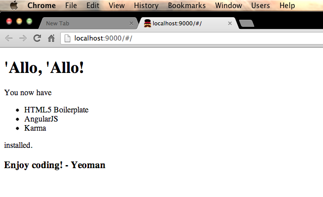
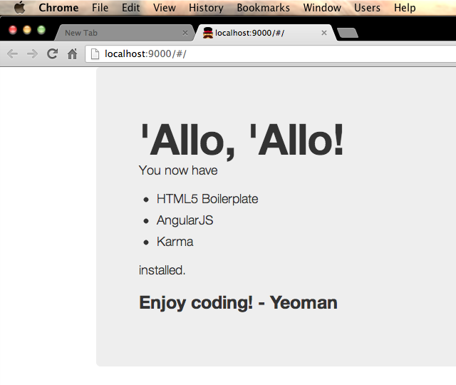
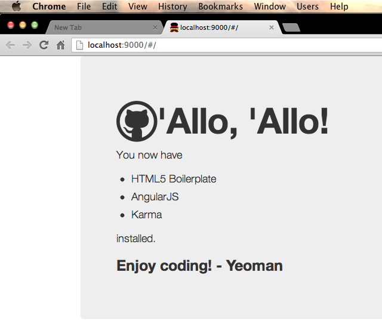

# Introducing Grunt-booty

Grunt is great, that’s no revelation, so I thought I would get in on the action by creating a quick plugin that at least I would find useful.  It’s no small coincidence that the plugin I wanted to create also requires [Bower](http://bower.io/) and works best with [Yeoman](http://yeoman.io) because Yeoman-Grunt-Bower are great together.


## What does it do?

Grunt-booty is a simple assembly task that helps to create your project css scaffolding using [Bootstrap](http://twitter.github.io/bootstrap/index.html) and [Font-awesome](http://fortawesome.github.io/Font-Awesome/) installed via Bower.

The task is designed to work with a Yeoman scaffolded Angular app but it has a couple of parameters that means it will work just fine with other projects too.  At the moment it is at version 0.2.x and assumes your project is using [Less](http://lesscss.org/).

### Why Less?

Well at the moment Yeoman is at version 1.0 beta and favours using the [Sass](http://sass-lang.com/) flavour of Bootstrap, specifically using [Compass](http://compass-style.org/) to compile Bootstrap into useable css.

If you want to use Less then there are generators for Yeoman flying around but I wanted to be able to install Bootstrap using Bower and run a quick task to include it into my project.

### This is an assembly task, why isn’t it a Yeoman generator?

Before Yeoman you could use Grunt to perform basic boiler-plate scaffolding and general assembly tasks but then along came Yeoman which lets Grunt just concentrate on performing build tasks.  This is a good thing because Grunt is great at running build tasks and Yeoman is great at running scaffolding tasks!

But for now Grunt-booty is a Grunt task; if you’re using Grunt to build your project then it’s trivial to add this task to build in Bootstrap and Font-awesome.  Sure, the separation of concerns is now blurred but it fulfils a purpose and helps to make it easier to get your project started so let’s get started with an example.

## Using Grunt-booty

_Grunt-booty is currently at v0.2.x, keep up with the docs on [Github](https://github.com/mattstyles/grunt-booty) for the latest additions and instructions to use the plugin_

The initial use-case for Grunt-booty was to add Bootstrap and Font-awesome-more to a Yeoman scaffolded Angular app so the following steps will do just that and you’ll end up with a project with the css bits ready to go _(this will be fairly detailed but if you just skip through the steps they are really simple and shouldn’t take more than a few minutes to complete, future versions of Grunt-booty should remove several of these steps to make things even easier)_:

### Scaffold your project

Our project is imaginatively titled ‘bootilicious‘, run these at your command line to get the ball rolling:

```bash
1 npm install -g yo grunt-cli bower
2 npm install -g generator-angular generator-karma
3 mkdir bootilicous && cd $_
4 yo angular
5 bower install bootstrap font-awesome-more --save
6 npm install grunt-booty grunt-contrib-less --save-dev
7 mkdir -p app/styles/{css,less}
8 rm app/styles/main.css
```

* _Lines 1-2_</br>
  Make sure __grunt__, __yeoman__, __bower__ and the __angular generator__ are all installed and ready to use _( [more info](http://yeoman.io) )_.  I’m just going to assume you have [node](http://nodejs.org/) and therefore [npm](https://npmjs.org/) installed (the plugin will run fine on 0.8 or 0.10).

* _Line 3_</br>
  Create the directory and move into it, ready to get our project going.

* _Line 4_</br>
  The meat!  Let Yeoman do its thing and scaffold out the bulk of the project for you, it’ll prompt you for a few things, hit `n` for the Bootstrap stuff and do what you like with the additional Angular stuff, I normally like to use it so include it.  Stick some coffee on, it normally takes a few minutes—it‘ll do a Bower and npm install of all the various pieces you’ll need and then you’ll have a project ready to go.  If you want to have a look at the output then hit up `Grunt server` and you’ll see the generated index page and its glorious lack of css.


  
  </br>Let’s fix that up.

* _Lines 5-6_</br>
  Let Bower do its thing and get you the latest of Bootstrap and Font-awesome-more and then let npm go and get you Grunt-booty and also Grunt-contrib-less which will compile your Less so that we can actually see the fruit of Grunt-booty in your project.

* _Lines 7-8_</br>
  This is a little bit of manual scaffolding so that Grunt-booty has a place to move over Bootstrap and Font-awesome-more.  This step is on the roadmap for Grunt-booty to handle itself as it shouldn’t be a manual task, but for now it is so go ahead and create the `css` and `less` folders and get rid of `main.css` (you could just move it into the `css` folder if you wanted although the Less compile step will do this for you later).

### Add the main Less file and tell the index page where to find the project css

Create `main.less` inside `app/styles/less` and add these lines:

```less
@import './../bootstrap/bootstrap';
@import './../bootstrap/responsive';
@import './../font-awesome-more/font-awesome';
```

Now open up `app/index.html` and change line 14 to point to where our compiled less file (main.css) will be:

```html
<link rel="stylesheet" href="styles/css/main.css">
```

These steps should, again, be handled by Grunt-booty but for now are a manual step.  The three import statements place Bootstrap and Bootstrap-responsive into your project while also including Font-awesome to give you access to all the lovely icons.  If you want the additional icons that are installed along with Font-awesome-more then you’ll need to import their less files as well, for now we’ll just stick with the main Font-awesome icons.

You might notice that your IDE or text editor is telling you that the import files don’t exist, and they don’t yet but they will do once we’ve set up and run Grunt-booty.

### Configure Gruntfile to include Grunt-booty and the Less compilation task

Yeoman will have scaffolded out your project with a meaty and extremely useful Gruntfile so let’s add to that by configuring the Grunt-booty and Grunt-contrib-less tasks.  Open up Gruntfile.js and add these tasks to the `initConfig` object:

```javascript
booty: {
  dev: {
    options: {
      componentPath: '<%= yeoman.app %>/components/',
      dest: '<%= yeoman.app %>/styles/'
    }
  }
},
less: {
  dev: {
    options: {
      paths: ['<%= yeoman.app %>/styles/less/']
    },
    files: {
      '<%= yeoman.app %>/styles/css/main.css': '<%= yeoman.app %>/styles/less/main.less'
    }
  }
}
```

So this is where Grunt-booty happens.  Version 0.2.1 of Grunt-booty uses just two configuration options: the path to the Bower components (in our case __Bootstrap__ and __Font-awesome__) and the destination path to place them in (we’ll be placing them into our projects’ `/styles/` directory which helps to keep our project nice and clean and manageable).

If you’re not using Yeoman to scaffold your project then these two options will still allow you to use Grunt-booty.

Go ahead and run the two tasks to see what Grunt-booty is doing:

```bash
grunt booty
grunt less
```

Grunt booty will have gone and got Bootstrap and Font-awesome from the Bower install and placed them into `/styles/`, doing a little bit of poking around at the same time to ensure that the paths to the font icons are still valid.

Earlier on we set up our `main.less` file to import the stuff we wanted into our project and the `grunt less` task just compiles that file into `main.css` ready for `index.html` to grab it when we run it.

### The fruit - our project with styles applied

Let’s go ahead and have a look at the output, run this at the command line:

```bash
grunt server
```

The Grunt server task was generated when we used Yeoman to generate our project and it creates a server to serve our project and then watches it for changes (at the moment it does some coffee script and compass compilation that we don’t want but we’ll sort that in a minute).




You should now see in your browser the `index.html` file we looked at earlier but now we have Bootstrap styles in it!  Hurray for the hero unit!

There is currently nothing in the markup to make sure that Font-awesome installed correctly and is being used so let’s make use of that watch and live-reload task that `grunt server` is running and make a quick change on the fly.

Open up `app/views/main.html` and change line 2 to include an icon from Font-awesome:

```html
<h1><i class="icon-github icon-large"></i> 'Allo, 'Allo!</h1>
```




If you’re seeing the nice Github icon in the title then everything has worked and you’re now ready to do the actual job of creating your awesome project.  All in all, including downloading time, it shouldn’t have taken more than 5 minutes to get your project, with css, ready to rock.

As we’re using less and we’ve added the less compilation task to the Gruntfile you can go ahead and strip out the compass tasks from the Gruntfile and even `npm uninstall grunt-contrib-compass` to tidy up.  I don’t tend to use coffee-script either so that gets stripped out for me as well.

### Links

* [grunt-booty on npm](https://npmjs.org/package/grunt-booty)

* [grunt-booty on github](https://github.com/mattstyles/grunt-booty)

If you found this task useful then make sure to hit the star button on [github](https://github.com/mattstyles/grunt-booty) and use `npm star grunt-booty`

---

Want to discuss this article?  Hit me up [@veryfizzyjelly](https://twitter.com/veryfizzyjelly)

---

Posted in [Coding](../"coding") on April 23rd 2013.  _Grunt-booty_, _Gruntplugin_, _Yeoman_, _Angular_, _Bower_, _Bootstrap_, _Font-awesome_