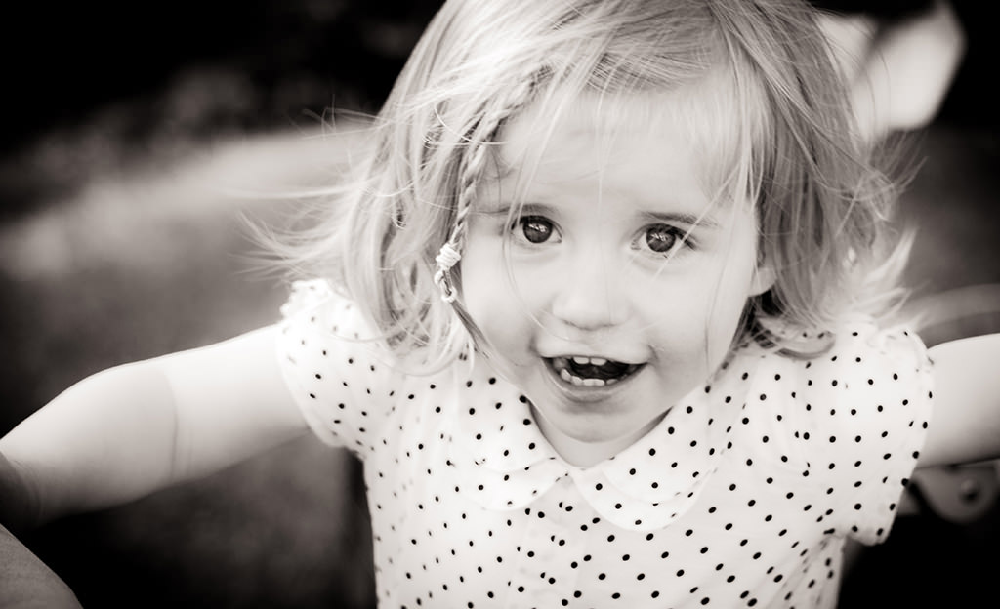
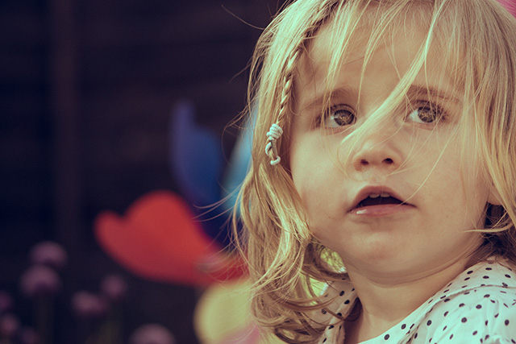

# It’s all in the eyes

  

Recently I’ve been exploring some extra things that I can do in Lightroom and I’ve been absolutely loving it.  I shoot in RAW so Lightroom is a good fit but the speed and ease at which you can work and the level of _adjustments_ you can make are astonishing.  Sure, you can _break_ a photo, but you can also lift it and if you’re using _cheaper_ lenses then they’ll often need just a little bit of buffing on top of all your hard work setting a scene, composing a shot and telling a story.

One technique that I have been using recently (although I haven’t always had a great new photograph to use it on) is the __Iris Enhance Brush__.

The shot above has undergone fairly heavy processing but it isn’t the same without a quick upping of exposure and contrast to the eyes which really help them to pop and, for me at least, make the image and drive the story.

These photos (including a different treatment of the above) have also benefitted from a little extra detail being brought forward.

---

Posted in [Photography](../ "Photography") on June 5th 2013.  _Canon 650d_, _Photography_, _Georgia_, _Lightroom_