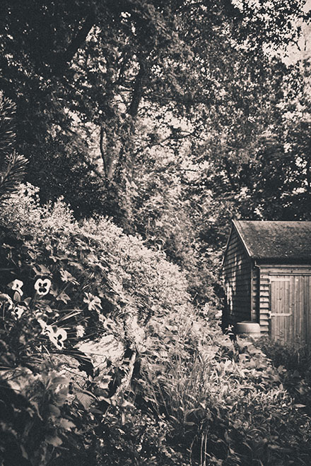

# The Bank at Speen Moors

Shortly after my Mother and Father moved into the house that they will leave this week they purchased a strip of land  that was previously used as part of the Newbury to Lambourn line (not far from the abandoned Newbury West Fields Halt station) in order to extend their garden.

The ensuing months were spent clearing the bank, using the flame gun to bring back the large boulders, raking over clinker, arranging soil, cutting trees to use as banking, building a veranda and, of course, a hefty amount of planting.

Now that they are leaving the house for fresh French pastures I thought I would catch some snaps.  I’ve been trying to create more depth in my photos so got myself prone on the highly uncomfortable stairs that wind up the bank, tried to keep myself as steady as possible to get a decent shot and used some of the banking logs as a lead-in line for the photo.  The image above is the result, which I’m fairly pleased with.

It was shot fairly wide open at 23mm and in order to try and keep the shutter speed high enough to be hand-held (the large tripod I’ve got wasn’t much help on the tight slope of the staircase I was lying on) the aperture was also pretty wide at f/3.2.  I tried some shots with tighter apertures to get more focus but couldn’t drag enough light out of the shadowed bank and keep the lens quick enough to get any decent hand-held shots.

I’ve also been playing with the color settings in Lightroom and working on producing better black & white prints and the photo of the bank seemed perfect to try out some techniques on.  Apart from greens and browns the only real colour in the photo ended up being the pansies in the foreground (although there was some vibrant broom in the background, and the sky of course) which really stand out against the texture that is created by a high contrast black & white treatment.

I think I could probably have also used a graduated filter starting somewhere just above the barn to create a little contrast between the tree-laden sky and the bank in the foreground, and Mother would tell me she isn’t too happy the photo was taken _before_ any weeding but apart from that I’m fairly pleased with the result.

---

Posted in [Photography](../ "Photography") on June 2nd 2013.  _Canon 60d_, _Photography_, _RailwayBank_