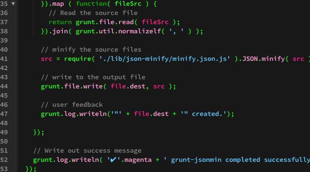

# Brackets Sprint 25

<div class="text-center"></div>

</br>

If you’re anything like me then you are a little choosy in what you want from your text editor or IDE.  I like a minimalist feel and I don’t really want all the extra clutter and weight you get with a dedicated and mature IDE but I want a little more than [vim](http://www.vim.org/) as my full-time coding environment (although I love vim).  This sounds like a job for Brackets.

### Enter Brackets

So I’ve been hacking around on [Brackets](http://brackets.io) for a month now, and after a little hesitation, have really embraced the excitement of early adoption.

Sure, there are bits that don’t work quite right and there are bits that plain don’t work but that is part of the fun.  The [development roadmap](https://trello.com/board/brackets/4f90a6d98f77505d7940ce88) uses trello (in-keeping with the philosophy of the project) and the [Google group for developers](https://groups.google.com/forum/?fromgroups#!forum/brackets-dev) is nice and busy.  Beyond that, I know that I can hack around in there myself and fix up (if I’m able) anything I want, there is also a growing base of [extensions](https://github.com/adobe/brackets/wiki/Brackets-Extensions), most of which are well documented and also still in development.

### Brackets and Github

So, how would you go about changing the way Brackets works?

Well, the project is hosted on [Github](https://help.github.com/articles/using-pull-requests) so part of the beauty of it is embracing the combined knowledge and work-time of the community.  If you spot something that doesn’t work quite right or could be improved then fix it up, submit a pull request and you could very quickly and easily become a part of the Brackets development team if your code gets accepted.  Brilliant.

The code is also well organised, mostly logically named and well commented so having a poke around is usually an enjoyable experience and even if you don‘t want to go hacking around in core (which isn’t wildly encouraged anyway, for good reason) it’s a good place to learn about project organisation and some nice javascript best practises.

### Changing The Order Of Files

If you’re using Brackets on a Mac then you get the Mac way of ordering items alphabetically in the sidebar that houses your project files.  However, I’d prefer it if the items were organised so that the folders are at the top and the files proceed after that (the Windows way) because I just can’t get used to alphabetical sorting.

Normally with a text editor this would be done via the preferences, no big deal.  As of yet Brackets has no easily configurable preferences and it could be that whichever editor you’re using doesn’t support file organisation like this so you’d be stuck.  Not so with Brackets, we can change that right up if we’re comfortable with javascript.

_If you haven’t already got Brackets up and running then head on over to the [download section](http://download.brackets.io/) and get yourself the latest build, currently sprint 25._

With Brackets installed we want to do a little digging into the meat of it and find out what we want to change so open up finder, right click on the Brackets Sprint 25 application (or whichever sprint is current), show package contents and navigate through to `/contents/www/` to have a look at what Brackets really is.

The vast majority of Brackets is written using Javascript, CSS (specifically the [Less](http://www.lesscss.org/) flavour) and HTML.

The `/project/` folder is a pretty good place for some minor hacking (I should note that hacking the core like this isn’t really recommended and will be overwritten when you download a new build so if you’re thinking of making any changes more major than the one-liner proposed here you’ll want to think of maintaining a [fork](https://help.github.com/articles/fork-a-repo), or, better still, creating an extension).

The file we’re actually after is `ProjectManager.js` which holds all sorts of _preference_ style stuff.  In sprint 25 the line we are looking for specifically is line 473 although if you’re working on a different sprint the line numbers are likely to be different; the function you’re looking for is the one that renders our file tree, logically called `_renderTree`.

So you should be looking at `ProjectManager.js` in Brackets (yes, the irony of developing Brackets __on__ Brackets should make the world explode, like Googling _Google_) and the function we need to _fiddle_ with is the `sort` function which looks like this (in sprint 25):

```javascript
sort :  function (a, b) {
  if (brackets.platform === "win) {
    // Windows: prepend folder names with a '0' and file names with a '1' so folders are listed first
    var a1 = ($(a).hasClass("jstree-leaf") ? "1" : "0") + this.get_text(a).toLowerCase(),
        b1 = ($(b).hasClass("jstree-leaf") ? "1" : "0") + this.get_text(b).toLowerCase();
    return (a1 > b1) ? 1 : -1;
  } else {
    return this.get_text(a).toLowerCase() > this.get_text(b).toLowerCase() ? 1 : -1;
  }
}
```

So all this function does is differentiate by platform and do some trickery using numbers to order by type on a Windows platform or alphabetically elsewhere.

If we were writing this as an extension then we might want to do something more complex but all we want is to be able to order files by type so we just want to make sure the first clause of the `if` statement gets executed, so, change line 473 of sprint 25 to do just that:

```javascript
if (brackets.platform === "win" || true) {
```

Simples!  It’s not going to win any awards for responsible or clever coding but that’s not our aim, we just want to _mutate_ Brackets to work as we want.  The change will be overwritten by new builds and we’re really only waiting for this to be an option when the preferences section is fleshed out anyway.

### The Exclude Files List

While we’re hacking about in `ProjectManager.js` there’s another useful area we want to be aware of.  Part of the philosophy of Brackets is to be minimalistic and let you focus on your project and your code.  In any project there are a number of files or folders that you don’t really want cluttering up your working directories, one way is to move them all about but this is time-consuming, error-prone and plain annoying, the other way is to just hide them.

Brackets has such an exclusion list and until there are preferences to pick what to exclude we’ll have to hack in there and exclude them manually.  The quick search (using cmd-F) for likely places where such a function would exist throws up the `shouldShow` function (on line 640 of sprint 25):

```javascript
function shouldShow(entry) {
  if ([".git",
       ".gitignore",
       ".gitmodules",
       ".svn",
       ".DS_Store",
       ".idea",
       ".settings",
       ".sass-cache",
       "Thumbs.db",
       ".hg"].indexOf(entry.name) > -1) {
       return false;
  }
  var extension = entry.name.split('.').pop();
  if (["pyc"].indexOf(extension) > -1) {
    return false;
  }
  return true;
}
```

All I’ve done to my `shouldShow` function is declare each file name pattern on a new line so I can see it a little clearer and added some file patterns (such as _.sass-cache_ and _.DS_Store_) that I don’t want showing up in my file tree.

I should probably also exclude the _node_modules_ folder from a project because I think there is a file limit in Brackets but I haven’t hit that limit yet so it stays for now.  If I wanted to exclude it then I’d just add it to the exclude list in the `shouldShow` function and reload Brackets using cmd-R.

## What’s new in sprint 25

So before sprint 25 the sidebar wasn’t particularly useful—you could select files to work on but not a great deal else.  Sprint 25 has added some extra functionality, such as deleting a file, showing the file in the OS (usually Finder or Explorer) or being able to refresh the file tree without having to reload Brackets—all pretty useful and basic stuff.

The extension system has an extra layer of gloss with the extension manager which can now help you manage your extensions a little easier.  It allows you to remove an extension but doesn’t (yet) allow you to just turn off an extension—although you can normally turn off an extension via the menu bar.

A major point for me for any editor is the code intelligence and Brackets now uses Tern as standard (rather than via an extension) which is great and helps to ensure that both projects remain healthy (the Brackets team have helped to maintain and improve the CodeMirror project, which Brackets uses as the basis for it’s text editor) and continue to grow quickly and improve.

The other changes for sprint 25 include some performance tweaks and the live previewing feature.

## Theme Development

As a little teaser of other things that are really easy to achieve in Brackets here’s a shot of the theme I’m currently using which was developed quickly and easily (I’m a little picky on what my editor looks like, luckily changing this in Brackets is really simple):



If you’re interested in developing your own themes, or want to know more about _tweaking_ the look and feel then I’ll be writing a separate post on that and releasing my theme via Github as a starting point.

### Links

* [Brackets](http://brackets.io/)

* [Download Brackets](http://download.brackets.io/)

* [Tern](http://ternjs.net/)

* [Less](http://www.lesscss.org/)

* [CodeMirror](http://codemirror.net/)

---

Want to discuss this article?  Hit me up [@veryfizzyjelly](https://twitter.com/veryfizzyjelly)

---

Posted in [Soap](../ "soap") on May 30th 2013.  _Brackets_

