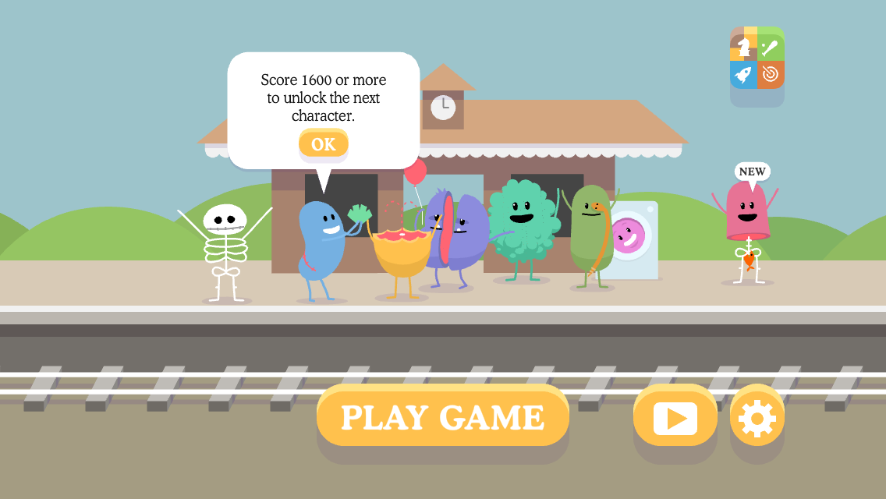
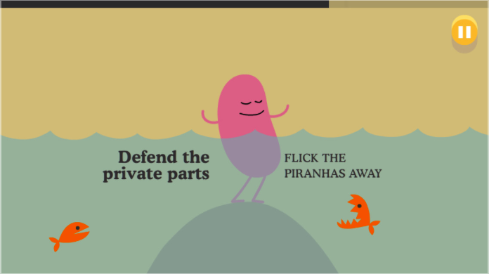

# Dumb Ways To Die

Sometimes you feel like a higher force is conspiring to bring you towards something, and so it was with finding this quirky little game from [McCann Melbourne](http://www.mccann.com.au/) for the [Australian Metro](http://www.metrotrains.com.au/).

The premise is simple, you have three lives and must face a challenge in each of the extremely short ‘levels’.  The challenge really heats up as the levels get progressively faster.  

Hardly an original idea for a game but this game is free promotional game to accompany a film for the Australian Metro to raise awareness of safety around trains, and it is loaded with character and fun.

### Piranha Man

So I mentioned earlier that it was as if some higher force was drawing me to this game; well there I was flicking through the app store looking for the [Metro app](http://metro.co.uk/2011/10/18/metro-on-mobile-how-to-get-metro-apps-on-iphone-ipad-and-android-187368/) (as in, the London Metro, a free daily newspaper) and I find this little gem of a game.

I couldn’t resist the opportunity to _defend the private parts_ from piranha attack and what I got in return was a heightened awareness of train safety!  Win, win!

### Links

* [Dumb Ways To Die](https://itunes.apple.com/gb/app/dumb-ways-to-die/id639930688?mt=8)

* [dumbwaystodie.com awareness campaign](http://dumbwaystodie.com/)

* [McCann Melbourne](http://www.mccann.com.au/)

---

_Update: Since writing this the app has gone to the top of the free downloads!  Never in doubt.

---

Posted in [Soap](../ "Soap") on May 28th 2013.  _DumbWaysToDie_, _TrainSafetyAwareness_, _AustralianMetro_, _McCannMelbourne_, _DefendThePrivateParts_