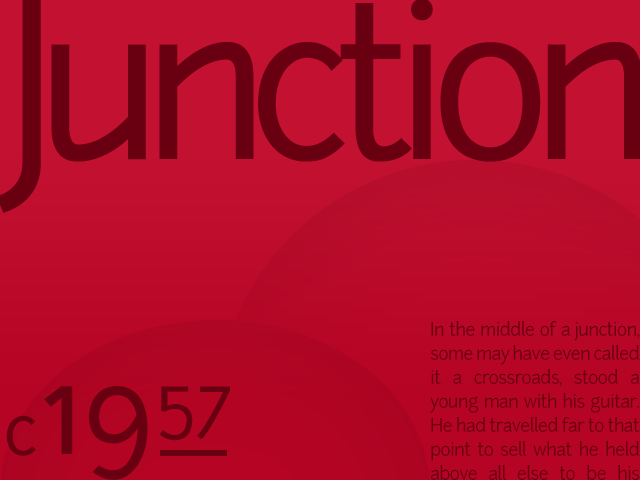
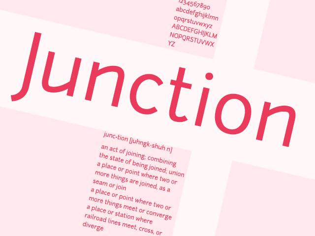
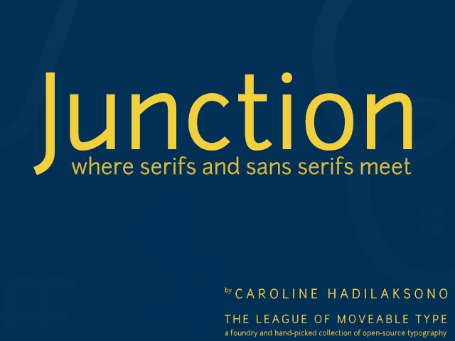

# Junction

## Junction

### By Caroline Hadilaksono

> Junction is a humanist sans-serif, and the first open-source type project started by The League of Moveable Type.

> From The League of Moveable Type

The League of Moveable Type is an initiative to raise the standards of web design that focusses on improving the quality of type on the web—chiefly through [typeface](http://en.wikipedia.org/wiki/Typeface).  If you haven't yet heard of them then it’s worth having a look at what they’re doing, it’s all [open-source](https://github.com/theleagueof "The League Of - on Github") and it’s fantastic.

Junction is a quirky sans-serif that _borrows_ some of the hand-drawn qualities of a serif and combines them with the clarity of a sans-serif.

### Links

[Caroline Hadilaksono](http://www.hadilaksono.com/junction)

[The League Of Moveable Type](http://www.theleagueofmoveabletype.com/junction)

---

Posted in [Typography](../"typography") on 16th March 2013.  _Junction_, _TheLeagueOf_, _CarolineHadilaksono_, _Typeface_

